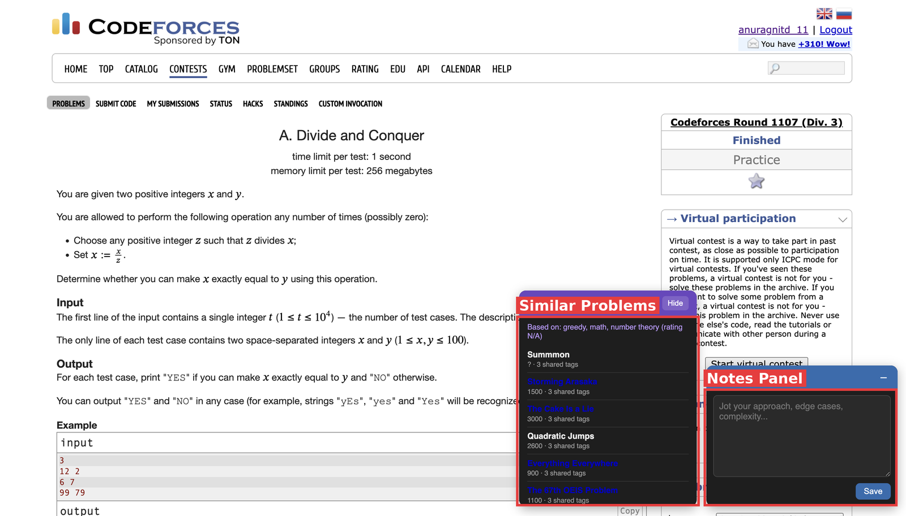
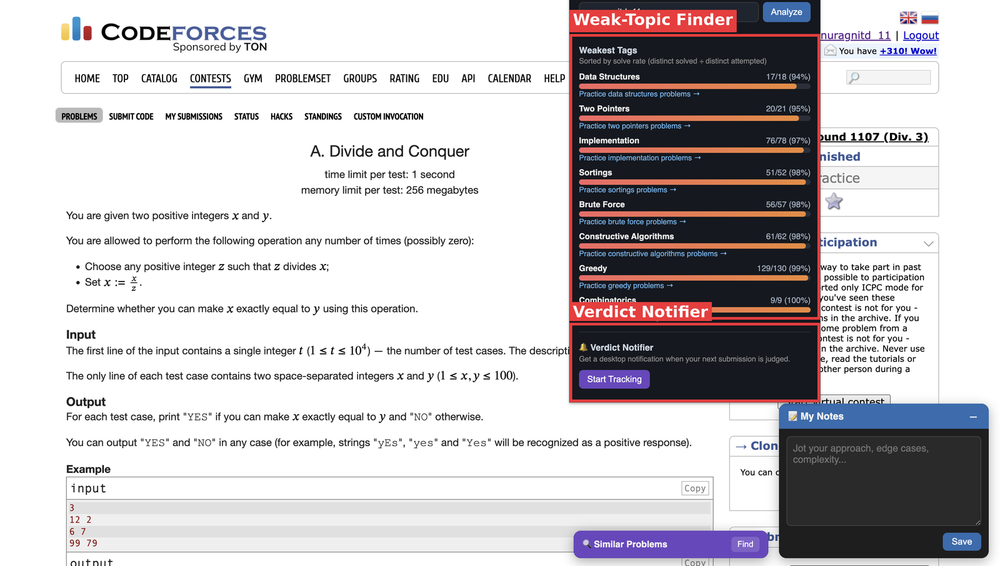
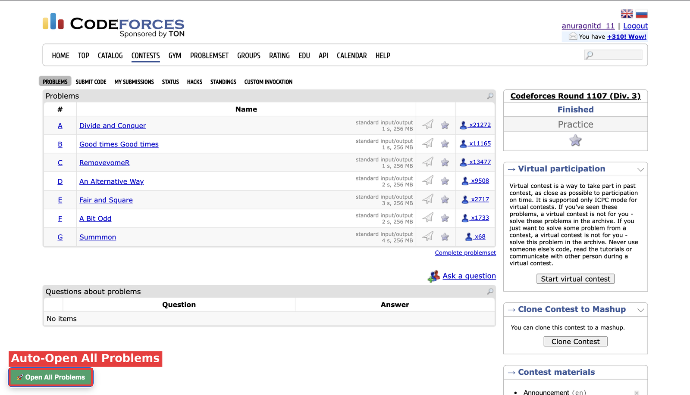

# CF Companion

A Chrome extension that adds practice tools directly on top of [Codeforces](https://codeforces.com) — per-problem notes, a weak-topic analyzer, a similar-problem recommender, a one-click "open all problems" button, a live contest rank tracker, and a submission verdict notifier.

Built to solve my own competitive programming workflow: too many tabs, no memory of past approaches, no easy way to see which topics I actually need to practice, and no way to know my rank or verdict without babysitting the tab.

  

---

## Screenshots

**Notes panel + similar-problem recommender, live on a problem page:**



**Weak-topic finder and verdict notifier, in the extension popup:**



**One-click auto-open for every problem in a contest:**



<!-- Optional: add a GIF once recorded -->
<!--  -->

---

## Features

| Feature | What it does |
|---|---|
| 📝 **Notes Panel** | A floating notes box on every problem page. Notes autosave per-problem and reload automatically when you revisit. |
| 📊 **Weak-Topic Finder** | Pulls your submission history from the CF API and ranks your topics by solve rate, so you know exactly what to drill. |
| 🔍 **Similar Problems** | Finds other problems with overlapping tags and a comparable rating to the one you're currently viewing. |
| 🚀 **Auto-Open All Problems** | One click opens every problem in a contest as separate tabs. |
| 🏆 **Live Contest Rank** | Shows your current rank, points, and penalty right next to the problem during a contest, auto-refreshing every 30 seconds. |
| 🔔 **Verdict Notifier** | Get a desktop notification the moment a pending submission is judged — no need to keep refreshing the tab. |

---

## Tech Stack

- **Vanilla JavaScript** — no frameworks, to keep the extension lightweight and dependency-free
- **Chrome Extension APIs (Manifest V3)**:
  - `chrome.storage.local` — persisting notes, cached API responses, and user settings
  - `chrome.runtime` (message passing) — communication between content scripts, popup, and background service worker
  - `chrome.tabs` — programmatically opening problem tabs
  - `chrome.alarms` — periodic background polling for the verdict notifier (survives service worker suspension)
  - `chrome.notifications` — OS-level desktop alerts
- **Codeforces public API** — `user.status`, `problemset.problems`, and `contest.standings` endpoints for live submission, problem, and standings data

No backend, no database — every feature runs client-side in the user's own browser and talks directly to Codeforces' public API.

---

## Architecture

The extension is split across three isolated execution contexts, which is the core architectural challenge of any non-trivial Chrome extension:

```
┌───────────────────┐    chrome.runtime.sendMessage    ┌────────────────────────┐
│  Content Scripts   │ ────────────────────────────────▶ │  Background Service    │
│  (injected into    │                                    │  Worker                │
│   Codeforces pages)│ ◀──────────────────────────────── │  (chrome.tabs,         │
│                     │            response                │   chrome.alarms,       │
└───────────────────┘                                    │   chrome.notifications)│
         │                                                └────────────────────────┘
         │ reads/writes
         ▼
┌───────────────────┐
│  chrome.storage    │ ◀──── also read/written by the popup
│  .local            │
└───────────────────┘
         ▲
         │
┌───────────────────┐
│  Popup (weak-topic │
│  finder + verdict  │
│  tracker toggle)   │
└───────────────────┘
```

- **Content scripts** inject UI directly into Codeforces pages and read/write `chrome.storage.local` for anything that just needs to persist (notes, cached problem data, saved handles).
- **Background service worker** handles anything content scripts can't do themselves — opening new tabs, scheduling recurring checks with `chrome.alarms`, and firing OS-level notifications. It stays inactive until a message or alarm wakes it up, then goes back to sleep (standard Manifest V3 behavior).
- **Popup** is a separate context that only runs while the extension icon's dropdown is open; it fetches from the CF API on demand and caches results so re-opening the popup is instant.

---

## Project Structure

```
cf-companion/
├── manifest.json           # Extension config, permissions, content script registration
├── background.js           # Service worker: tab opening, alarms, notifications
├── content-notes.js        # Notes panel logic
├── content-notes.css
├── content-similar.js      # Similar-problems recommender
├── content-similar.css
├── content-autoopen.js     # Auto-open-all-problems button
├── content-autoopen.css
├── content-rank.js         # Live contest rank panel
├── content-rank.css
├── popup.html               # Weak-topic finder UI + verdict tracker toggle
├── popup.js
├── popup.css
└── icons/
    ├── icon16.png
    ├── icon48.png
    └── icon128.png
```

---

## Installation (local / unpacked)

This project isn't published on the Chrome Web Store — it's built for personal use and as a portfolio piece. To run it:

1. Clone this repository
   ```bash
   git clone https://github.com/<your-username>/cf-companion.git
   ```
2. Open `chrome://extensions` in Chrome
3. Enable **Developer mode** (top-right toggle)
4. Click **Load unpacked** and select the `cf-companion` folder
5. Visit any [Codeforces](https://codeforces.com) problem page — the notes panel and similar-problems panel should appear automatically

---

## Usage

- **Notes**: Just start typing in the panel that appears bottom-right on any problem page. It saves automatically.
- **Weak-Topic Finder**: Click the extension icon, enter your Codeforces handle, and hit Analyze.
- **Similar Problems**: Click "Find" on the panel next to your notes on any problem page.
- **Auto-Open**: On any contest page, click the green button bottom-left.
- **Live Rank**: On any contest problem page, enter your handle once in the gold panel top-right — it then auto-refreshes your rank, points, and penalty every 30 seconds.
- **Verdict Notifier**: In the popup, click "Start Tracking" — you'll get a desktop notification the moment your next submission is judged.

---

## Technical Decisions

A few choices worth understanding (and defending in an interview):

- **No backend, no database** — every feature only needs data scoped to a single user in a single browser. `chrome.storage.local` covers this natively, so adding a server would be unnecessary complexity.
- **Polling over WebSockets** — Codeforces doesn't expose a push/webhook API, so both the verdict notifier and the rank tracker poll on an interval instead. The verdict notifier uses `chrome.alarms` (background context, needs to survive service worker suspension); the rank tracker uses a plain `setInterval` inside its content script (tied to a live tab, doesn't need to survive suspension) — a deliberate distinction based on which execution context each feature lives in.
- **Fetching a single standings row, not the full scoreboard** — `contest.standings` is called with a `handles` filter so only the current user's row is returned, keeping the request cheap even in a contest with thousands of participants.
- **24-hour cache for `problemset.problems`** — this endpoint returns the entire problem catalog (~10k+ problems) and rarely changes, so caching avoids an expensive refetch on every page load.
- **Message passing instead of direct API access from content scripts** — `chrome.tabs`, `chrome.alarms`, and `chrome.notifications` aren't available inside content scripts by design (Chrome's security model), so the background service worker acts as the privileged intermediary.
- **Pausing polling on tab visibility change** — the rank tracker stops its interval when the tab isn't visible and resumes when it becomes visible again, avoiding wasted API calls on a tab nobody is looking at.

---

## Possible Future Improvements

- [ ] Unify the separate handle inputs (weak-topic finder, verdict tracker, rank panel) into a single saved "my handle" setting
- [ ] Sync notes across devices via `chrome.storage.sync`
- [ ] Export notes as Markdown
- [ ] Add unit tests for the tag-aggregation and similarity-scoring logic
- [ ] Support CodeChef alongside Codeforces
- [ ] Dark/light theme toggle

---

## License

MIT — free to use, modify, and learn from.
